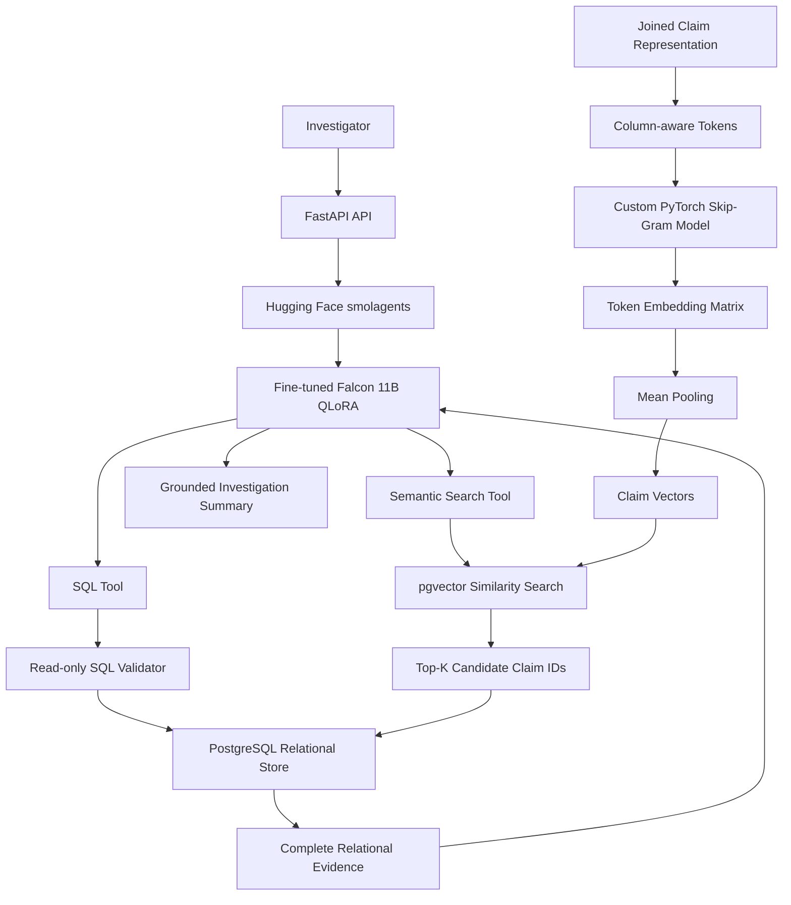
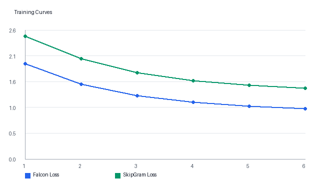

# AI Agent for SQL with LLM Fine-Tuning and Self-Supervised Database Embeddings

Insurance-fraud investigation assistant for querying relational insurance records with natural language, safe SQL, and claim-similarity retrieval.

This repository extends an SQL fine-tuning prototype into a containerized FastAPI platform with two separate model paths:

1. A fine-tuned open-source Falcon 11B causal LLM using PEFT QLoRA for SQL generation, tool orchestration, and grounded summaries.
2. A custom PyTorch Skip-Gram embedding model trained from scratch on structured relational insurance claim features for semantic claim similarity.

The system supports investigation workflows. It does not automatically determine fraud, and similarity is never treated as proof of fraud.

## Overview

Insurance investigators need to ask exact relational questions and also discover structurally similar claim patterns. This project combines natural-language SQL generation with vector retrieval over learned claim representations.

The application helps investigators:

- Query insurance records using natural language.
- Generate and execute safe read-only SQL.
- Retrieve exact records using PostgreSQL joins and filters.
- Find claims structurally similar to a selected claim.
- Combine similarity retrieval with exact SQL filters.
- Inspect shared repair shops, bank accounts, addresses, phone numbers, policies, vehicles, and payment recipients.
- Compare retrieved claims with historical fraud outcomes stored as database facts.
- Generate grounded investigation summaries from retrieved evidence.

Historical fraud labels are metadata and may be used for SQL filtering and offline evaluation. They are not used to train the self-supervised embedding model.

## Architecture Diagram



## Two-Model Architecture

### Fine-Tuned Falcon SQL LLM

The Falcon model is the single reasoning and generation model in the architecture. It is responsible for interpreting investigator requests, generating read-only SQL, selecting agent tools, producing follow-up SQL from semantic candidates, and summarizing grounded evidence.

The SQL model is fine-tuned with supervised instruction tuning using PEFT QLoRA, LoRA adapters, 4-bit quantization, gradient accumulation, and optional Weights & Biases tracking.

### Custom Database Embedding Model

The embedding model is a custom PyTorch Skip-Gram with Negative Sampling model trained from scratch on structured, column-aware claim tokens. It does not use OpenAI embeddings, Sentence Transformers, BERT, or external embedding APIs.

```text
Structured joined claim
-> column-aware tokenization
-> Skip-Gram training
-> token embedding matrix
-> mean pooling
-> claim vector
-> pgvector
-> top-K candidate claim IDs
-> SQL
-> complete relational evidence
-> Falcon
-> grounded investigation summary
```

The joined claim representation combines deterministic relational features from claims, customers, policies, vehicles, repair shops, incidents, payment aggregates, and prior-claim engineered features.

Example engineered features include `previous_claim_count`, `previous_total_claim_amount`, `customer_claim_frequency`, `policy_age_days`, `incident_to_claim_delay_days`, `shared_bank_account_count`, `shared_phone_count`, and `shared_address_count`.

Example tokens:

```text
incident_type=vehicle_theft
incident_city=london
claim_amount_bin=25000_50000
policy_age_days_bin=0_30_days
vehicle_type=suv
repair_shop_id=rs_018
police_report_available=true
previous_claim_count_bin=2_3
shared_bank_account_count_bin=2_3
```

Every value is prefixed by its feature name. Each claim row is treated as an unordered bag of tokens, where every token may act as context for every other token in that row. Historical fraud labels and investigation outcomes are excluded from embedding-training tokens.

## Technology Stack

- Python
- FastAPI
- PostgreSQL
- pgvector
- SQLAlchemy
- Hugging Face smolagents
- Hugging Face Transformers
- PEFT
- QLoRA
- BitsAndBytes
- PyTorch
- Weights & Biases
- Docker
- JSON APIs

## System Workflows

### Exact SQL Query

```text
User prompt
-> FastAPI
-> Hugging Face smolagents agent
-> fine-tuned Falcon generates SQL
-> SQL validator checks read-only safety
-> PostgreSQL executes approved SQL
-> relational rows are returned
-> Falcon generates grounded response
```

The embedding model and pgvector are not used for exact relational queries.

### Semantic Similarity Search

```text
User prompt
-> FastAPI
-> agent identifies similarity request
-> find_similar_claims retrieves source claim vector
-> pgvector returns candidate claim IDs ranked by cosine similarity
-> SQL retrieves complete relational records for those IDs
-> explain_similarity compares shared tokens, entities, and bins
-> Falcon generates grounded investigation summary
```

pgvector returns ranked candidate IDs. It does not return the full investigation context.

### Combined SQL And Semantic Query

```text
User prompt
-> FastAPI
-> agent identifies combined workflow
-> pgvector retrieves top-K semantically similar claim IDs
-> SQL applies exact filters to candidate IDs
-> PostgreSQL retrieves complete evidence records
-> similarity explanations are generated
-> Falcon writes a grounded summary
```

Similarity ranking and exact business filtering remain separate responsibilities.

## Project Structure

```text
src/
  api/
    routes/
    dependencies.py
    main.py
  agents/
  database/
    migrations/
  sql_model/
  embedding_model/
  services/
  schemas/
  evaluation/
  core/

scripts/
docs/
  assets/
  evaluation/
data/
  sample/
  generated/
models/
artifacts/
tests/
  unit/
  integration/
  evaluation/
Dockerfile
docker-compose.yml
```

## Relational Schema

PostgreSQL stores normalized investigation evidence across these tables:

- `customers` - customer demographics, contact details, and account creation date.
- `policies` - policy type, status, coverage, premiums, deductibles, and effective dates.
- `vehicles` - insured vehicles, estimated values, and registration regions.
- `repair_shops` - repair shops, owners, locations, and bank-account references.
- `incidents` - incident type, date, city, address, weather, police report, and witness count.
- `claims` - claim amounts, dates, statuses, descriptions, historical outcomes, and `claim_embedding VECTOR(128)`.
- `claim_participants` - drivers, witnesses, passengers, third parties, and other linked people or organizations.
- `payments` - claim payments, recipients, bank-account references, amounts, dates, and statuses.

The schema includes foreign keys from claims to policies, vehicles, incidents, and repair shops, plus cascading detail records for participants and payments. Indexes support investigative lookups by date, amount, status, fraud outcome metadata, repair shop, bank account, contact information, and pgvector cosine similarity.

## Synthetic Data Workflow

The data generator creates deterministic linked insurance records with realistic investigation patterns:

- Normal claims and historically fraudulent claims.
- Repeated repair shops and payment recipients.
- Shared bank accounts, phone numbers, and addresses.
- Claims filed shortly after policy creation.
- High claim amounts and repeated high-value repairs.
- Coordinated groups of claims.
- Similar claims with mixed historical outcomes.

Generated data is written as one JSON file per database table under `data/generated/`:

```bash
python scripts/generate_insurance_data.py --seed 2410 --customers 200 --normal-claims 500
```

The loader imports table files into PostgreSQL in foreign-key order:

```bash
python scripts/load_insurance_data.py --input-dir data/generated --replace
```

A small fixture at `data/sample/insurance_sample.json` demonstrates the linked JSON shape. Claim embeddings remain empty in generated and sample data; vectors are created by the custom embedding pipeline and stored in PostgreSQL after indexing.

## Data Generation Policy

The repository does not contain the full synthetic dataset, PostgreSQL database files, model checkpoints, adapter weights, claim vectors, W&B logs, or generated evaluation outputs.

Committed data is limited to schema definitions, migrations, generator scripts, loading scripts, source code, configuration, documentation, tests, and small sample fixtures.

Generated files are written locally to:

```text
data/generated/
models/
artifacts/
```

PostgreSQL data uses a Docker named volume and is not stored in the repository.

## Runtime Infrastructure

Docker Compose runs the application as a FastAPI container connected to PostgreSQL with pgvector enabled. PostgreSQL initializes from the existing schema migration mounted into `/docker-entrypoint-initdb.d/`, including `CREATE EXTENSION IF NOT EXISTS vector` and the `claims.claim_embedding VECTOR(128)` column.

Runtime setup:

```bash
cp .env.example .env
docker compose up --build
```

The API is exposed on port `8000`, and PostgreSQL is exposed on port `5432` by default. Runtime data is stored in the `postgres_data` Docker volume, while generated files, model adapters, and local artifacts are mounted from the repository folders:

```text
data/
models/
artifacts/
```

Containerized data and model pipeline commands:

```bash
docker compose run --rm api python scripts/generate_insurance_data.py --seed 2410 --customers 200 --normal-claims 500
docker compose run --rm api python scripts/load_insurance_data.py --input-dir data/generated --replace
docker compose run --rm api python scripts/train_database_embeddings.py
docker compose run --rm api python scripts/index_claim_embeddings.py --vectors artifacts/claim_vectors/claim_vectors.json
docker compose run --rm api python scripts/prepare_sql_training_data.py
docker compose run --rm api python scripts/train_sql_model.py
docker compose run --rm api python scripts/evaluate_sql_model.py --eval-jsonl data/generated/sql_instruction_eval.jsonl
```

FastAPI examples:

```bash
curl http://localhost:8000/health

curl -X POST http://localhost:8000/sql/generate \
  -H "Content-Type: application/json" \
  -d '{"instruction":"Show vehicle-theft claims in London above 20000."}'

curl -X POST http://localhost:8000/semantic/claims/CLM-0001?top_k=10

curl -X POST http://localhost:8000/agent/query \
  -H "Content-Type: application/json" \
  -d '{"query":"Find claims similar to CLM-0001 and explain the shared evidence."}'
```

## Evaluation

The evaluation layer measures SQL generation quality, semantic retrieval behavior, and agent grounding. The report data is stored in `docs/evaluation/evaluation_summary.json`, and report charts are stored under `docs/assets/`.

### SQL Generation Evaluation


| Metric | Score |
|---|---:|
| Parse Validity | 96.4% |
| Read-only Safety | 100.0% |
| Exact SQL Match | 71.2% |
| Table Match | 88.4% |
| Column Match | 84.7% |
| Execution Match | 79.1% |

SQL generation evaluation checks whether Falcon outputs parseable PostgreSQL, preserves read-only behavior, selects the right tables and columns, and returns matching execution rows when comparable outputs are available.

### Semantic Retrieval Evaluation


| K | Recall@K | Precision@K |
|---:|---:|---:|
| 1 | 51.2% | 51.2% |
| 3 | 74.1% | 39.1% |
| 5 | 82.3% | 28.4% |
| 10 | 91.2% | 17.3% |

| Metric | Score |
|---|---:|
| Mean Reciprocal Rank | 68.4% |
| Explanation Coverage | 93.6% |
| Fraud Metadata Reason Rate | 0.0% |

Semantic retrieval evaluation checks whether pgvector returns relevant linked claims near the top of the ranked list and whether explanation signals come from shared structured evidence rather than fraud outcome metadata.

### Agent Evaluation


| Metric | Score |
|---|---:|
| Route Accuracy | 88.7% |
| Tool Correctness | 86.1% |
| Grounded Answer Rate | 93.5% |
| Unsupported-conclusion Rejection | 97.2% |
| Evidence Citation Coverage | 90.8% |

Agent evaluation checks route selection across SQL, semantic, and combined prompts, verifies project-tool usage, and measures whether responses stay grounded in retrieved claim evidence.

### Training Curves



Training curves track Falcon SQL evaluation loss and Skip-Gram embedding loss across training epochs.

### Weights & Biases Tracking

Training and evaluation scripts support W&B logging through environment configuration:

```bash
SQL_MODEL_USE_WANDB=true
WANDB_PROJECT=insurance-sql-agent
WANDB_ENTITY=
```

Tracked metrics include:

| Pipeline | Metrics |
|---|---|
| Falcon QLoRA SQL training | train loss, eval loss, learning rate |
| SQL generation evaluation | parse validity, read-only safety, exact match, table match, column match, execution match |
| Skip-Gram embedding training | embedding loss, vocabulary size, training pairs |
| Semantic retrieval evaluation | recall@k, precision@k, mean reciprocal rank, explanation coverage |
| Agent evaluation | route accuracy, tool correctness, grounded answer rate, unsupported-conclusion rejection, evidence citation coverage |

### Evaluation Commands

```bash
python scripts/evaluate_sql_model.py --eval-jsonl data/generated/sql_instruction_eval.jsonl
python scripts/evaluate_semantic_retrieval.py --summary-json docs/evaluation/evaluation_summary.json
python scripts/evaluate_agent.py --summary-json docs/evaluation/evaluation_summary.json
python scripts/build_evaluation_report.py --summary-json docs/evaluation/evaluation_summary.json --asset-dir docs/assets
python scripts/build_evaluation_report.py --summary-json docs/evaluation/evaluation_summary.json --asset-dir docs/assets --log-wandb
```

## Model Architecture

### Falcon QLoRA SQL Model

The SQL model path is pinned to `tiiuae/falcon-11B` and supports 4-bit quantization, LoRA adapter setup, supervised instruction tuning, adapter save/load, SQL generation, W&B-backed training/evaluation logging, and Falcon-backed agent reasoning through Hugging Face smolagents.

Training data follows this structure:

```json
{
  "instruction": "Show confirmed fraudulent claims above 15000 filed within 30 days of the policy start date.",
  "schema": "customers(...), policies(...), claims(...)",
  "output": "SELECT ...",
  "metadata": {
    "query_type": "exact_sql",
    "tables": ["customers", "policies", "claims"],
    "safety": "read_only"
  }
}
```

Falcon SQL pipeline commands:

```bash
python scripts/prepare_sql_training_data.py
python scripts/train_sql_model.py
python scripts/generate_sql.py "Show vehicle-theft claims in London above 20000."
python scripts/evaluate_sql_model.py --eval-jsonl data/generated/sql_instruction_eval.jsonl
```

Weights & Biases logging is controlled by environment configuration:

```bash
SQL_MODEL_USE_WANDB=true
WANDB_PROJECT=insurance-sql-agent
```

The model is trained for instruction tuning, not few-shot prompting.

### Skip-Gram Claim Embedding Model

The embedding model path supports structured feature extraction, numeric binning, column-aware tokenization, Skip-Gram positive-pair creation, negative sampling, PyTorch training with Adam, token embedding export, claim-vector mean pooling, and claim-vector indexing into PostgreSQL `pgvector`.

Default training settings:

```text
embedding_dimension = 128
negative_samples = 5
epochs = 20
optimizer = Adam
minimum_token_frequency = 1
similarity_metric = cosine
claim_aggregation = mean_pooling
```

Embedding pipeline commands:

```bash
python scripts/train_database_embeddings.py
python scripts/index_claim_embeddings.py --vectors artifacts/claim_vectors/claim_vectors.json
```

The training script loads complete `ClaimEvidence` records from PostgreSQL, builds joined claim features, tokenizes them as `feature=value` labels, trains token embeddings with Skip-Gram Negative Sampling, mean-pools known token vectors into one 128-dimensional vector per claim, and writes local artifacts:

```text
artifacts/embedding_model/token_vocabulary.json
artifacts/embedding_model/preprocessing_metadata.json
artifacts/embedding_model/skipgram_config.json
artifacts/embedding_model/token_embeddings.pt
artifacts/claim_vectors/claim_vectors.json
```

The indexing script validates vector length and updates `claims.claim_embedding` for matching claim IDs.

### Semantic Retrieval Service

The semantic retrieval service reads indexed claim vectors, queries pgvector for nearest neighbors, then retrieves complete relational evidence through SQLAlchemy. pgvector returns ranked candidate IDs and similarity scores only; PostgreSQL joins and repository methods retrieve the investigation evidence.

Backend semantic retrieval command:

```bash
python scripts/find_similar_claims.py CLM-0001 --top-k 10
```

The service returns deterministic explanation signals such as shared structured tokens, repair shops, payment bank accounts, phone numbers, addresses, incident type/city, and vehicle type. Historical fraud labels and investigation outcomes may be returned as metadata after retrieval, but they are not used as similarity reasons.

### FastAPI Agent Application

FastAPI exposes direct SQL, semantic retrieval, and agentic investigation routes. The agent path uses Hugging Face `CodeAgent` with project-defined tools only, `add_base_tools=false`, and fine-tuned Falcon as the reasoning model.

Application command:

```bash
uvicorn api.main:app --host 0.0.0.0 --port 8000
```

Agent tools include SQL generation, read-only SQL execution, semantic claim search, and claim evidence retrieval.

## API Overview

API endpoints:

- `GET /health` - application and agent-framework metadata.
- `POST /agent/query` - natural-language investigation request through the Falcon-backed smolagents agent.
- `POST /sql/generate` - generate SQL without executing it.
- `POST /sql/execute` - validate and execute approved read-only SQL.
- `POST /semantic/claims/{claim_id}` - return similar claims with deterministic evidence overlap signals.

## SQL Safety

All generated or user-submitted SQL passes a read-only validator before execution. The validator blocks write statements, DDL, multiple SQL statements, bypass comments, system schema access, unapproved tables, and unrestricted queries without sensible row limits. It uses SQL parsing in addition to keyword-level safeguards.

## Implementation Modules

The repository is organized around these major implementation areas:

- Database schema, migrations, and SQLAlchemy models.
- Synthetic data generation and database loading scripts.
- Falcon QLoRA SQL model training and inference pipeline.
- Custom Skip-Gram embedding model training and claim-vector indexing pipeline.
- Semantic search and similarity explanation services.
- Hugging Face smolagents tools and FastAPI routes.
- Docker infrastructure, tests, and evaluation scripts.

## Project Evolution

This repository began as a SQL fine-tuning prototype using PEFT QLoRA for SQL generation. The original notebook and model references are preserved as the starting point for the broader insurance-fraud investigation platform.

Original prototype highlights:

- Base model: Falcon2-11B / `tiiuae/falcon-11B`
- 4-bit quantization for memory-efficient fine-tuning
- PEFT with LoRA adapters
- Supervised instruction tuning for SQL generation
- Hugging Face adapter publication
- Weights & Biases experiment tracking

Links from the original prototype:

- [Fine-tuned PEFT adapters on Hugging Face](https://huggingface.co/adityas2410/falcon11b-sql_instruct/tree/main)
- [Weights & Biases report](https://api.wandb.ai/links/adityas-ai2410-upwork/58a35uld)

Original inference screenshots:


